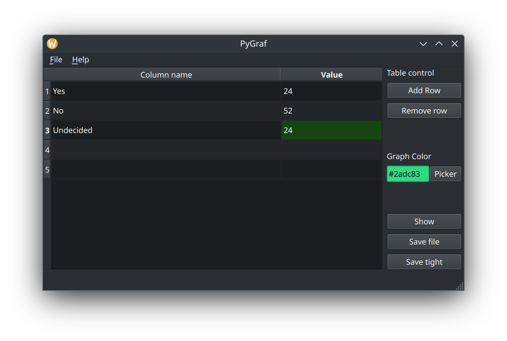
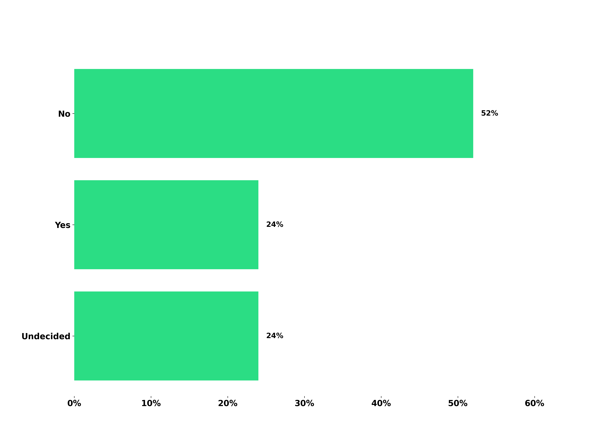

# PyGraf

<!--toc:start-->
- [PyGraf](#pygraf)
  - [Why](#why)
  - [What's next](#whats-next)
  - [Showcase](#showcase)
<!--toc:end-->

This is a quick and dirty program that generates bar graph.

Project uses latest python and Qt6 framework.

## Why

I needed a graph, asked ChatGpt to generate said graph. ChatGpt generated python code that uses matplotplot library.

My reaction was "Don't mind if I do". I took the code, changed it a bit and created Qt UI around it.

And that's it.

## What's next

I'd like to improve this code a bit, but honestly, I'm not in business of graph generation, so this might be it

Maybe next time I'm bored

TODO:

- [ ] Error handling - for example, if you set wrong image format, program ends
- [ ] Better graph customizations
- [ ] Color picker
- [ ] Responsive UI
- [ ] Add sqlite for storing used colors and settings
- [ ] World graph domination?

## Showcase

